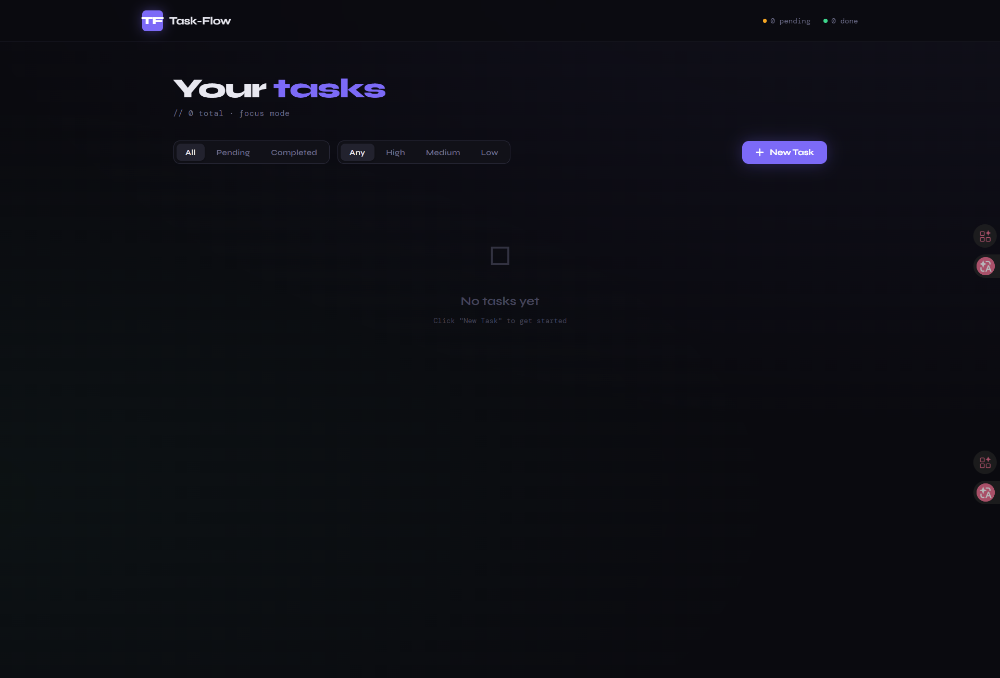

# Task-Flow ✦ Personal Task Manager

A clean, fast personal task management app built with **Next.js 14** (frontend) and **NestJS** (backend), with **PostgreSQL** for persistent storage.

---



## 🔗 Live Links

| Service      | URL                                                  |
|--------------|------------------------------------------------------|
| **Live App** | https://task-flow-frontend-chk3.onrender.com         |
| **API Docs** | https://task-flow-fis2.onrender.com/api/docs         |
| **GitHub**   | https://github.com/syedrafinulhuq/task-flow          |

---

## Tech Stack

| Layer    | Technology                         |
|----------|------------------------------------|
| Frontend | Next.js 14, React 18, TypeScript   |
| Backend  | NestJS 10, TypeScript              |
| Database | PostgreSQL (via node-postgres `pg`) |
| Styling  | Custom CSS (no framework)          |
| API Docs | Swagger UI (`@nestjs/swagger`)     |
| Hosting  | Render (frontend + backend + DB)   |

---

## Features

- ✅ View all tasks (title, description, status, priority, due date, created date)
- ✅ Add tasks with title, description, priority, and optional due date
- ✅ Toggle tasks between Pending / Completed
- ✅ Edit task inline (title, description, priority, due date)
- ✅ Delete tasks with confirmation dialog
- ✅ Filter by status (All / Pending / Completed)
- ✅ Filter by priority (Any / High / Medium / Low)
- ✅ Input validation on both frontend and backend
- ✅ Priority colour-coding (High = red, Medium = amber, Low = green)
- ✅ Overdue task highlighting
- ✅ Toast notifications for all actions
- ✅ Mobile-responsive layout
- ✅ Swagger API docs at `/api/docs`
- ✅ Meaningful HTTP status codes (201, 204, 400, 404, 500)

---

## Prerequisites

- **Node.js** v18 or later
- **npm** v9 or later
- **PostgreSQL** v14 or later (must be running locally)

---

## Local Setup

### 1. Clone the repository

```bash
git clone https://github.com/syedrafinulhuq/task-flow.git
cd task-flow
```

---

### 2. Create the PostgreSQL database

Open a terminal and connect to PostgreSQL:

```bash
psql -U postgres
```

> If `psql` is not recognised, use the full path:
> ```bash
> "C:\Program Files\PostgreSQL\17\bin\psql.exe" -U postgres
> ```
> Replace `17` with your installed PostgreSQL version.

Then create the database and exit:

```sql
CREATE DATABASE taskflow;
\q
```

> The table schema is created automatically when the backend starts — no migration needed.

---

### 3. Backend setup

```bash
cd backend
npm install
cp .env.example .env
```

Open `.env` and fill in your PostgreSQL credentials:

```dotenv
PORT=4000
FRONTEND_URL=http://localhost:3000
NODE_ENV=development

DATABASE_HOST=localhost
DATABASE_PORT=5432
DATABASE_NAME=taskflow
DATABASE_USER=postgres
DATABASE_PASSWORD=your_postgres_password
```

Start the backend dev server:

```bash
npm run start:dev
```

You should see:
```
PostgreSQL connected — tasks table ready
Task-Flow API    → http://localhost:4000
Swagger UI docs  → http://localhost:4000/api/docs
```

---

### 4. Frontend setup (open a new terminal)

```bash
cd frontend
npm install
cp .env.example .env
```

The default `.env` works out of the box:

```dotenv
NEXT_PUBLIC_API_URL=http://localhost:4000
```

Start the frontend dev server:

```bash
npm run dev
```

---

### 5. Open the app

| Service      | URL                            |
|--------------|--------------------------------|
| App          | http://localhost:3000          |
| Swagger Docs | http://localhost:4000/api/docs |

> Both backend and frontend terminals must be running at the same time.

---

## Environment Variables

### Backend (`backend/.env`)

| Variable            | Default                 | Description                        |
|---------------------|-------------------------|------------------------------------|
| `PORT`              | `4000`                  | Port the NestJS server listens on  |
| `FRONTEND_URL`      | `http://localhost:3000` | Allowed CORS origin                |
| `NODE_ENV`          | `development`           | Environment mode                   |
| `DATABASE_HOST`     | `localhost`             | PostgreSQL host                    |
| `DATABASE_PORT`     | `5432`                  | PostgreSQL port                    |
| `DATABASE_NAME`     | `taskflow`              | PostgreSQL database name           |
| `DATABASE_USER`     | `postgres`              | PostgreSQL username                |
| `DATABASE_PASSWORD` | —                       | PostgreSQL password (**required**) |

### Frontend (`frontend/.env`)

| Variable              | Default                 | Description          |
|-----------------------|-------------------------|----------------------|
| `NEXT_PUBLIC_API_URL` | `http://localhost:4000` | Backend API base URL |

---

## API Reference

| Method   | Endpoint                | Description                                            | Status Codes  |
|----------|-------------------------|--------------------------------------------------------|---------------|
| `GET`    | `/api/tasks`            | List all tasks (supports `?status=` and `?priority=` filters) | 200     |
| `GET`    | `/api/tasks/:id`        | Get a single task by ID                                | 200, 404      |
| `POST`   | `/api/tasks`            | Create a new task                                      | 201, 400      |
| `PUT`    | `/api/tasks/:id`        | Update task fields                                     | 200, 400, 404 |
| `PATCH`  | `/api/tasks/:id/toggle` | Toggle pending ↔ completed                             | 200, 404      |
| `DELETE` | `/api/tasks/:id`        | Delete a task                                          | 204, 404      |

Full interactive docs: **https://task-flow-fis2.onrender.com/api/docs**

---

## Database Schema

```sql
CREATE TABLE tasks (
  id          UUID         PRIMARY KEY DEFAULT gen_random_uuid(),
  title       VARCHAR(255) NOT NULL,
  description TEXT,
  status      VARCHAR(20)  NOT NULL DEFAULT 'pending'
                CHECK (status IN ('pending', 'completed')),
  priority    VARCHAR(10)  NOT NULL DEFAULT 'medium'
                CHECK (priority IN ('low', 'medium', 'high')),
  due_date    DATE,
  created_at  TIMESTAMPTZ  NOT NULL DEFAULT NOW(),
  updated_at  TIMESTAMPTZ  NOT NULL DEFAULT NOW()
);
```

---

## Project Structure

```
task-flow/
├── backend/
│   ├── src/
│   │   ├── controllers/
│   │   │   ├── tasks.controller.ts   # Route handlers + Swagger decorators
│   │   │   └── tasks.service.ts      # Business logic & PostgreSQL queries
│   │   ├── models/
│   │   │   ├── database.ts           # pg Pool connection & schema init
│   │   │   └── task.dto.ts           # DTOs with Swagger @ApiProperty
│   │   ├── routes/
│   │   │   └── tasks.module.ts       # NestJS module
│   │   ├── app.module.ts             # Root module
│   │   └── main.ts                   # Server bootstrap + Swagger setup
│   ├── .env.example
│   ├── package.json
│   └── tsconfig.json
│
├── frontend/
│   ├── src/
│   │   ├── app/
│   │   │   ├── layout.tsx            # Root layout
│   │   │   └── page.tsx              # Main page
│   │   ├── components/
│   │   │   ├── TaskCard.tsx          # Individual task component
│   │   │   ├── AddTaskForm.tsx       # New task form
│   │   │   ├── ConfirmDialog.tsx     # Delete confirmation modal
│   │   │   └── Toast.tsx             # Toast notifications
│   │   ├── hooks/
│   │   │   └── useTasks.ts           # Task state management hook
│   │   ├── services/
│   │   │   └── taskService.ts        # API call functions
│   │   └── styles/
│   │       └── globals.css           # All styles (custom, no framework)
│   ├── .env.example
│   ├── next.config.js
│   ├── package.json
│   └── tsconfig.json
│
├── README.md
└── .gitignore
```

---

## AI Assistance

This project was scaffolded and developed with assistance from Claude (Anthropic). All architecture decisions, code structure, and implementation details were reviewed and understood during development.

---

## Explainer Video

Coming Soon — due to exam pressure it might take some time.